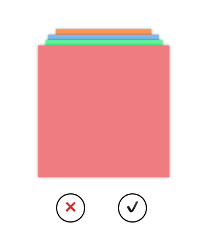

# css-cards

A React SPA project for showing a stack of cards. The user can accept or reject the cards to animate the stack and change the order the cards appear in.

## Example view

## Setup

- Git clone the repo to download the project files.

- In the terminal run: `npm install` to install all the dependencies for the project.

- Run `npm start` to get the app started.

- Head to http://localhost:3000/ in the browser to see it.

## My approach

I started out by setting up a simple create-react-app project as I wanted to jump into development quickly. As this animation style project was new to me I wanted to see whether there were any examples of it on the web. There were a few but they were all using jQuery and animation libraries which I wasn't familiar with. And so I decided to build the animated card stack from scratch in React with styled-components. I chose styled-components because of its flexibility with React and its general ease of use, alongside the styling being inside each component for added componentisation. I began by attempting to animate a single card via a hover, which was successful, meaning the card slid away to the side on hovering over it. Then I began building my other cards with translate3d, moving them into place. The initial set up of getting the onClick handlers to fire for each button I created was relatively easy, as the app has a simple state and prop system. However a larger amount of time was spent on the card transition logic. This seemingly straightforward project was surprisingly complex, but I enjoyed working through the logic to get it working correctly

## Due to time constraints

If I had more time to work on this project I would like to get the slide animation working in styled-components. I tried so many different variations of it but frustratingly none of them thus far have worked. I would also like to sit a premade version of the card stack next to mine to see the difference between them. You can find that [here](https://tympanus.net/Development/CardStackEffects/) (see the Krisna version). On top of these tasks I would like to build test suites to make sure I have good code coverage and have ironed out bugs that may crop up.
